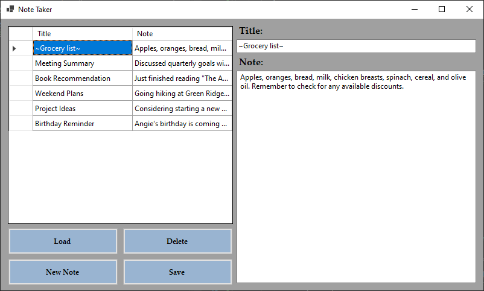

# NoteTaking App 📝

A simple, user-friendly application for taking and managing notes, built with Windows Forms.

## 🌟 Features

- **Easy to Use Interface**: Quickly jot down your thoughts or detailed notes.
- **Data Grid View**: Your notes are displayed in a tabular format for easy viewing and editing.
- **Instant Editing**: Double-click on any note to instantly edit its content.
- **No Sorting**: Columns are kept static for a consistent layout.
- **Clear Fields**: A dedicated button to clear the input fields, readying the app for a fresh note.

## 🚀 How to Use

1. **Adding a Note**: Write your title and note in the given fields and click the save button. Your note will instantly appear in the grid view.
2. **Editing a Note**: Double-click a note from the grid view or click the edit button to load it into the input fields. Make your changes and click save.
3. **Deleting a Note**: Select a note from the grid view and click the delete button.

## 🛠 Installation

1. Clone the repository or download the source code.
2. Open the solution in Visual Studio.
3. Build and run the application.
